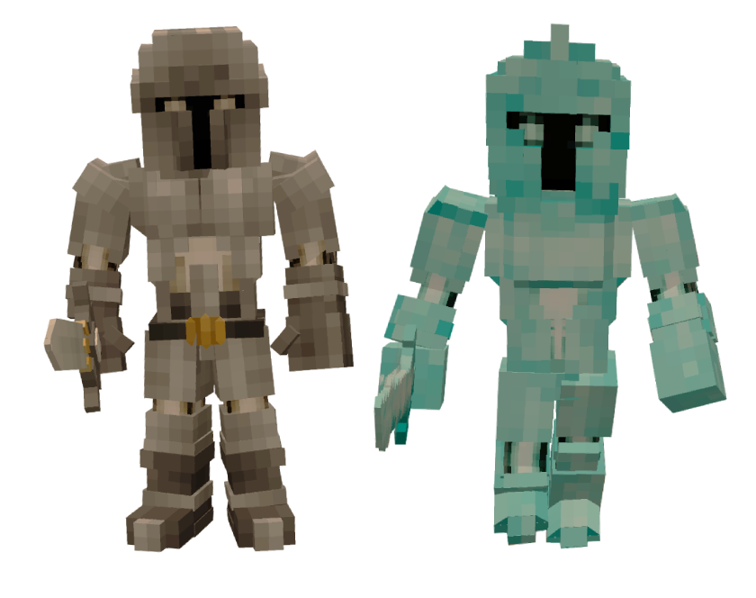

# ⚔️ Donjon Labyrinthe des Déchus

 Informations sur le Donjon

👥 <strong>Taille du Groupe</strong> : 2 ↔ 4

📈 <strong>Niveau Recommandé</strong> : 7+

<h2 align="center">Accéder au Donjon</h2>


Pour pouvoir créer la clef du Donjon et y pénétrer, vous aurez besoin de Tissus Maudits obtenable uniquement dans le [Donjon Squelette](donjon-squelette.md).


Pour accéder au Labyrinthe des Déchus, vous aurez besoin de la clé des Déchus, fabricable juste devant le Donjon :

* 🌿 <mark style="color:$success;">Fragments de Feuilles</mark> 20
* 📜 <mark style="color:purple;">Tissus Maudits</mark> 15
* 👻 <mark style="color:purple;">Âmes des Ruines</mark> 10


Les Fragments de Feuilles peuvent être récupérés après avoir tué un [Nephentes](../../monstres/carte-du-sud/mizunari/nephentes.md) (45% de chance)

Les Tissus Maudits peuvent être récupérés après avoir tué un [Squelette Mage](../../monstres/carte-du-sud/ruines-maudites/squelette-mage.md)  (50% de chance)

Les Âmes des Ruines peuvent être récupérés après avoir tué n'importe quel squelette trouvé à l'extérieur du [Donjon Squelette](donjon-squelette.md), comme les [Squelettes Épéiste](../../monstres/carte-du-sud/ruines-maudites/squelette-epeiste.md) (40% de chance), [Guerrier Squelette](../../monstres/carte-du-sud/ruines-maudites/guerrier-squelette.md) (40% de chance), [Squelette Hallebardier](../../monstres/carte-du-sud/ruines-maudites/squelette-hallbardier.md) (40% de chance)


***

<h2 align="center">Le Donjon</h2>

Le Labyrinthe des Déchus est un donjon subdivisé en 3 étages comportant chacun :

* 6 salles avec un coffre
* 2 emplacements possibles du forgeron (afin de créer votre panoplie)
* 1 Salle d'énigme (afin d'ouvrir la salle du Mini-Boss)
* 1 Mini-Boss (qu'il faudra vaincre pour avancer vers l'étage suivant)


Dans les coffres se trouvent des fragments de cristaux :

* une majorité de <mark style="color:red;">rouge</mark> au 1er étage
* une majorité de <mark style="color:yellow;">jaune</mark> au 2ème étage
* une majorité de <mark style="color:purple;">violet</mark> au 3ème étage


Après le 3ème étage se trouve le défi final du Labyrinthe des Déchus.


Pour accéder à l'arène du Boss, il vous faudra récupérer les 3 Artefacts des Fallen que vous obtiendrez après la mort de chaque Mini-Boss de Palier. Si vous n'avez pas ce qu'il faut pour ouvrir la fin du Donjon à cause d'une mort ou autre, alors vous ne pourrez pas finir le Donjon


***

Le Donjon comporte deux types de Monstres : les [<mark style="color:blue;">Soldats Déchus</mark>](../../monstres/carte-du-sud/donjon-labyrinthe-des-dechus/soldat-dechu.md) et les [<mark style="color:$info;">Guerriers Déchus</mark>](../../monstres/carte-du-sud/donjon-labyrinthe-des-dechus/guerrier-dechu.md).\
Les premiers, de couleur <mark style="color:blue;">Bleu-Vert</mark> sont assez lents et ne tapent pas très fort\
Les derniers, de couleur <mark style="color:$info;">Grise</mark> vont vous courser rapidement et font très mal&#x20;

<figure><figcaption></figcaption></figure>


Plus vous avancerez dans les étages plus il y aura de Guerriers


***

<h2 align="center">Cartographie</h2>


&#x20;Légende :&#x20;

* En <mark style="color:green;">vert</mark>, l'entrée de l'étage
* En <mark style="color:yellow;">jaune</mark>, les salles avec un coffre
* En <mark style="color:purple;">rose</mark>, les emplacements de spawn du forgeron
* En <mark style="color:blue;">bleu</mark>, l'énigme à dechiffrer pour ouvrir la salle du boss
* En <mark style="color:red;">rouge</mark>, la salle du boss
* En <mark style="color:orange;">orange</mark>, les passages "bouche d'égout"




<h3 align="center">Carte</h3>

<figure><figcaption>
Schéma de l'étage 1 du Labyrinthe des Déchus
</figcaption></figure>

<h3 align="center">Énigme</h3>


Le but est de déplacer dans une labyrinthe une boite d'un point A vers un point B.\
Pour ce faire vous pouvez faire deux actions :

* Pousser la Caisse (_Clic Droit sur la Caisse_)
* Tourner dans le sens horaire la Caisse (_Sneak + Clic Droit sur la Caisse_)

Une flèche est visible sur la boite permettant de savoir vers où elle se déplacera




<h3 align="center">Mini Boss</h3>

Le premier Mini Boss: le [Héraut Déchu](../../monstres/carte-du-sud/donjon-labyrinthe-des-dechus/heraut-dechu.md) est un Assassin au corps-à-corps. Il n'est pas très compliqué de par ses dégâts et ses effets à l'impact.



<h3 align="center">Carte</h3>

<figure><figcaption>
Schéma de l'étage 2 du Labyrinthe des Déchus
</figcaption></figure>

<h3 align="center">Énigme</h3>


Le but est ici de réaliser un jump.\
Pour ce faire vous devrez cliquer sur 3 boutons différents afin de faire apparaître des blocs pour vous aider à faire le jump.\
Les boutons sont caché et nécessite de jouer avec l'attribut de taille




<h3 align="center">Mini Boss</h3>

Le deuxième Mini Boss: le [Gardien Déchu](../../monstres/carte-du-sud/donjon-labyrinthe-des-dechus/gardien-dechu.md) est un tank au corps-à-corps. Tout comme son confrère de l'étage précédent, il n'est pas très dangereux et peut être fait seul simplement.



<h3 align="center">Carte</h3>

<figure><figcaption>
Schéma de l'étage 3 du Labyrinthe des Déchus
</figcaption></figure>

<h3 align="center">Énigme</h3>


Le but ici est de faire un jump avec des bloc invisibles.\
Pour vous aider, des indicateurs seront parsemés à coté de chaque bloc sur lesquelles vous devrez sauter.\
N'oubliez pas d'activer le mécanisme à gauche avant de faire le jump d'une traite




<h3 align="center">Mini Boss</h3>

Le dernier Mini Boss: la [Faucheuse Déchu](../../monstres/carte-du-sud/donjon-labyrinthe-des-dechus/faucheuse-dechu.md) est un mage au corps-à-corps. Il se démarque des autres car en plus d'avoir énormément de dégâts, il va avoir aussi beaucoup de contrôle de foule. Faites bien attention à vous.




<h3 align="center">Étage 4 &#x26; comment accéder au Boss Final</h3>

Après avoir conquis les 3 précédent étages en tuant les 3 Mini-Boss Déchus et en récupérant leur Artefact des Fallen, il vous faudra disposer sur chacun des 3 piliers l'artefact pour faire s'ouvrir le passage se situant au milieu de la pièce.

<figure><figcaption>
Pilier qui peut contenir un Artefact des Fallen
</figcaption></figure>

Après ceci fait, une grande porte s'ouvrira une fois le Groupe entièrement réuni.


Ne vous inquiétez pas, cette règle prend uniquement en compte les membres du groupe encore en vie ou encore dans l'instance de votre donjon


***

Vous voilà enfin devant le Boss Final ou bien devront nous dire **les Boss Finaux**.\
Devant vous se trouve deux Boss, [Ornstein](../../monstres/carte-du-sud/donjon-labyrinthe-des-dechus/ornstein-devastateur-dechu.md): un Tank à la grande mobilité qui fera pleuvoir sur vous une pluie de feu, et [Smough](../../monstres/carte-du-sud/donjon-labyrinthe-des-dechus/smough-devastateur-dechu.md): un guerrier plutôt coriace qui bondira sur vous en vous brûlant par ses flammes dévastatrices.


Ce combat peut être simplifié. Même si dans la salle se trouve deux boss, leur champ d'agression est très faible, ce qui vous permettra de les battre un à la fois sans vous faire déborder par deux attaquants extrêmement coriaces




***

<h2 align="center">Récompenses</h2>

Il est possible d'obtenir plusieurs type de récompenses après avoir réussi le Donjon :

* Bourse 🪙<mark style="color:yellow;">Cols</mark> 500
* Bourse 🪙<mark style="color:yellow;">Cols</mark> 1000
* Bourse 🪙<mark style="color:yellow;">Cols</mark> 2000
* 🪨<mark style="color:purple;">Lingot d'Âme de Métal</mark> 1 ↔ 3
* 🪨<mark style="color:$info;">Lingot de Métal Enchanté</mark> 1 ↔ 3
