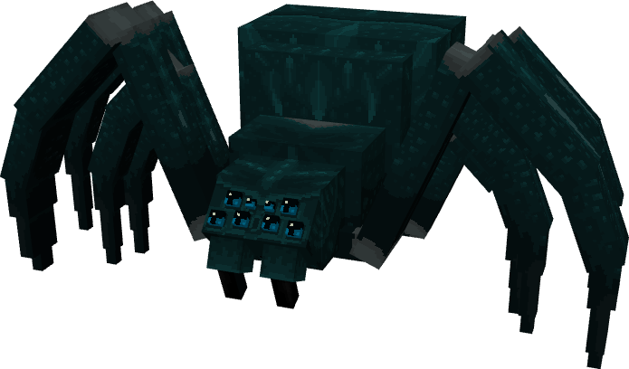

# 🌊 Kamilia

> _"Silencieuse au cœur du donjon, Kamilia tisse des pièges invisibles dans l'ombre. Sa morsure injecte un venin paralysant, laissant ses proies conscientes, mais incapables de fuir"_

📈 <strong>Niveau Recommandé</strong> : 9+

<figure><figcaption></figcaption></figure>


Cet Ennemi est un Monstre unique au Donjon [Xal'Zirith](../../../carte/donjons/donjon-xalzirith.md) (1008,1184)

