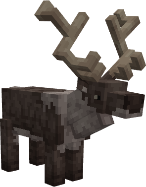

# 🦌 Cerf des Montagnes

> _"Majestueux et insaisissable, le Cerf des Montagnes habite les hauteurs glacées et les forêts enneigées. On raconte qu'il apparaît aux âmes pures, guidant les voyageurs égarés vers la sécurité"_

📈 <strong>Niveau Recommandé</strong> : 7+

<figure><figcaption></figcaption></figure>

<h2 align="center">Butin Commun</h2>

|                                                            Butin | Pourcentage Chance |
| ---------------------------------------------------------------: | ------------------ |
| 🦌 <mark style="color:orange;">Peau de Cerf des Montagnes</mark> | 45%                |
