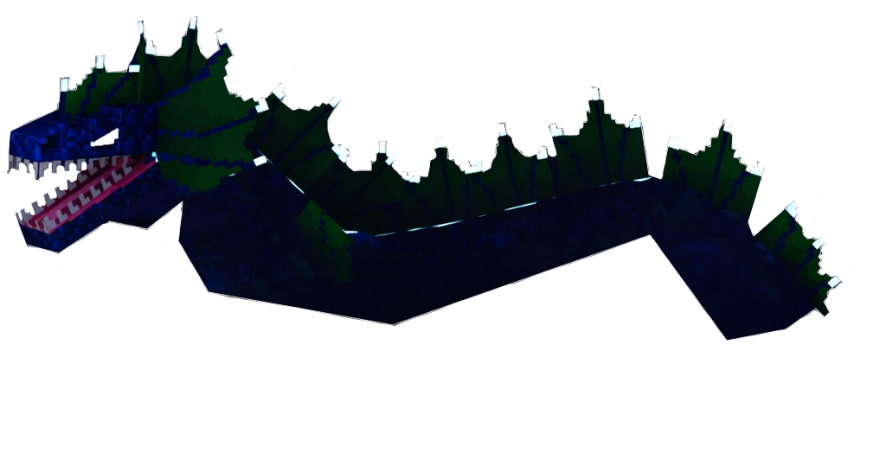

# 🐟 Nymbréa

> _"Serpent mythique glissant entre les courants profonds, Nymbréa incarne la grâce et la traîtrise des eaux calmes. Ses écailles scintillent comme des perles maudites, et son regard hypnotique attire les imprudents vers les abysses"_

📈 <strong>Niveau Recommandé</strong> : 7+

<figure><figcaption></figcaption></figure>

<h2 align="center">Informations</h2>



<h4 align="center">🗺️ <mark style="color:$success;">Positions</mark></h4>

1410,2140




<h4 align="center">⏱️ <mark style="color:purple;">Temps de Réapparition</mark></h4>

600 Secondes ↔ 10 Minutes




***

<h2 align="center">Butin Secret</h2>

|                                                                                Butin | Pourcentage Chance |
| -----------------------------------------------------------------------------------: | ------------------ |
| 💙 <mark style="color:blue;">Cœur de</mark> <mark style="color:blue;">Nymbréa</mark> | ?%                 |


Il est possible suivant la version du Butin que le Cœur de Nymbréa se nomme Cœur de Nautherion

