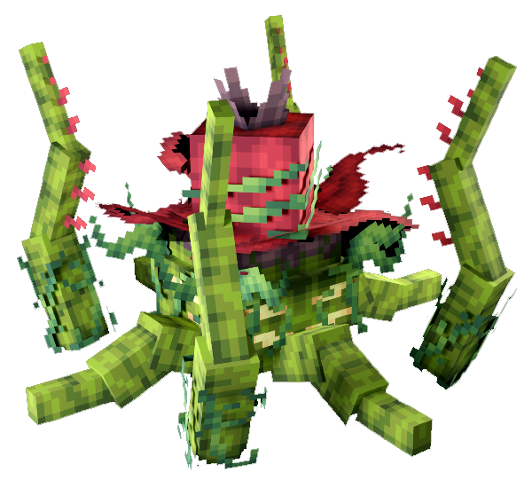

# 🌹 Vyrmos

> _"Entité rampante née des mines de Geldorak, Vyrmos s'imprègne des spores et de la terre humide. Sa peau est couverte de mousse vivante, et son souffle corrompt tout ce qu'il touche"_

📈 <strong>Niveau Recommandé</strong> : 4+

<figure><figcaption></figcaption></figure>


Cet Ennemi est un Monstre unique au Donjon [Mine de Geldorak](../../../carte/regions/mine-de-geldorak.md) (4274,3890)

