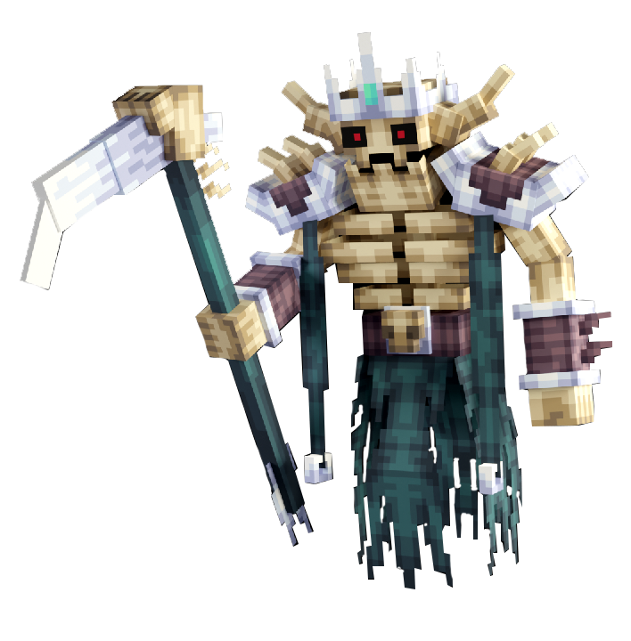

# ☠️ Narax Squelette Maudit

> _"Ancien général d'une armée déchue, Narax fut ressuscité par une magie interdite. Son armure brisée résonne encore de ses exploits d'antan, hantant les terres maudites. On dit que son regard vide perce jusqu'à l'âme._

📈 <strong>Niveau Recommandé</strong> : 4+

<figure><figcaption></figcaption></figure>

<h2 align="center">Butin Commun</h2>

|                                               Butin | Pourcentage Chance |
| --------------------------------------------------: | ------------------ |
| 🫀 <mark style="color:purple;">Cœur Putréfié</mark> | 70%                |

<h2 align="center">Butin Secret</h2>

|                                                                                                                                     Butin | Pourcentage Chance |
| ----------------------------------------------------------------------------------------------------------------------------------------: | ------------------ |
|       ☠️ [<mark style="color:purple;">Bâton de Squelette Maudit Mage</mark>](../../../equipement/armes/mage.md#baton-de-squelette-maudit) | ?%                 |
| ☠️ [<mark style="color:$success;">Bâton de Squelette Maudit Shaman</mark>](../../../equipement/armes/shaman.md#baton-de-squelette-maudit) | ?%                 |
