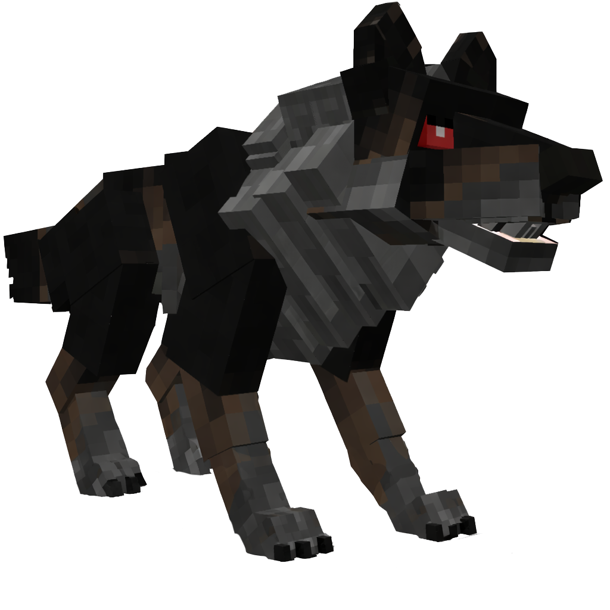

# 🐺 Albal

> _"Un loup solitaire aux yeux d'argent glacés. Son passage laisse une brume et le silence"_

📈 <strong>Niveau Recommandé</strong> : 2+

<h2 align="center">Informations</h2>



<h4 align="center">🗺️ <mark style="color:$success;">Positions</mark></h4>

2510,3964 2617,3836




<h4 align="center">⏱️ <mark style="color:purple;">Temps de Réapparition</mark></h4>

240 Secondes ↔ 4 Minutes




<figure><figcaption></figcaption></figure>

***

<h3 id="butin-commun" align="center">Butin Commun</h3>

|                                                 Butin | Pourcentage Chance |
| ----------------------------------------------------: | ------------------ |
| 🐺 <mark style="color:$info;">Fourrure de Loup</mark> | 100%               |
| 🦷 <mark style="color:$warning;">Crocs de Loup</mark> | 70%                |
| 🦷 <mark style="color:$danger;">Crocs de Albal</mark> | 20%                |
