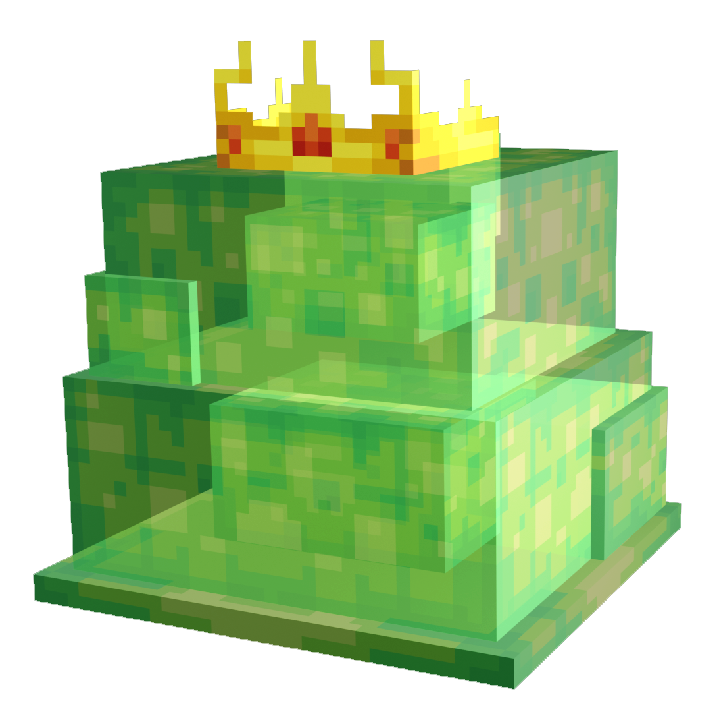

# 👑 Gorbel

> _"Un colosse gélatineux, maître des essaims de slimes. Il écrase tout sur son passage, lentement mais sûrement"_

📈 <strong>Niveau Recommandé</strong> : 3+

<h2 align="center">Informations</h2>



<h4 align="center">🗺️ <mark style="color:$success;">Positions</mark></h4>

300,3200




<h4 align="center">⏱️ <mark style="color:purple;">Temps de Réapparition</mark></h4>

600 Secondes ↔ 10 Minutes




<figure><figcaption></figcaption></figure>

***

<h2 id="butin-commun" align="center">Butin Commun</h2>

|                                                   Butin | Pourcentage Chance |
| ------------------------------------------------------: | ------------------ |
|  🍮 <mark style="color:$success;">Gelée de Slime</mark> | 30%                |
|     🥥 <mark style="color:green;">Noyau de Slime</mark> | 5%                 |
| 👑 <mark style="color:yellow;">Essence de Gorbel</mark> | 5%                 |
