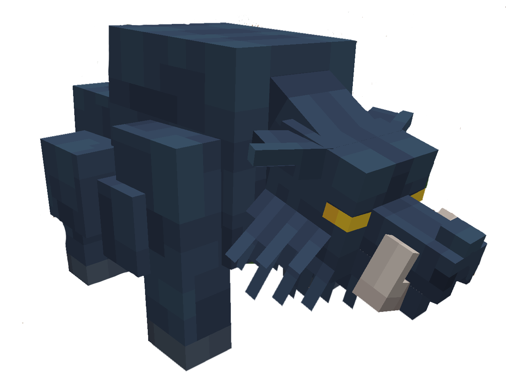

# 🐗 Sanglier Corrompu

> _"Une bête sauvage issue des forêts du premier palier. Il charge sans relâche, animé d'une rage primitive"_

📈 <strong>Niveau Recommandé</strong> : 2+

<figure><figcaption></figcaption></figure>

<h2 align="center">Butin Commun</h2>

|                                                           Butin | Pourcentage Chance |
| --------------------------------------------------------------: | ------------------ |
| 🍖 <mark style="color:$danger;">Viande de Sanglier</mark> 1 ↔ 3 | 100%               |
|             🐗 <mark style="color:red;">Peau de Sanglier</mark> | 60%                |
|          💎 <mark style="color:purple;">Cristal Corrompu</mark> | 50%                |
