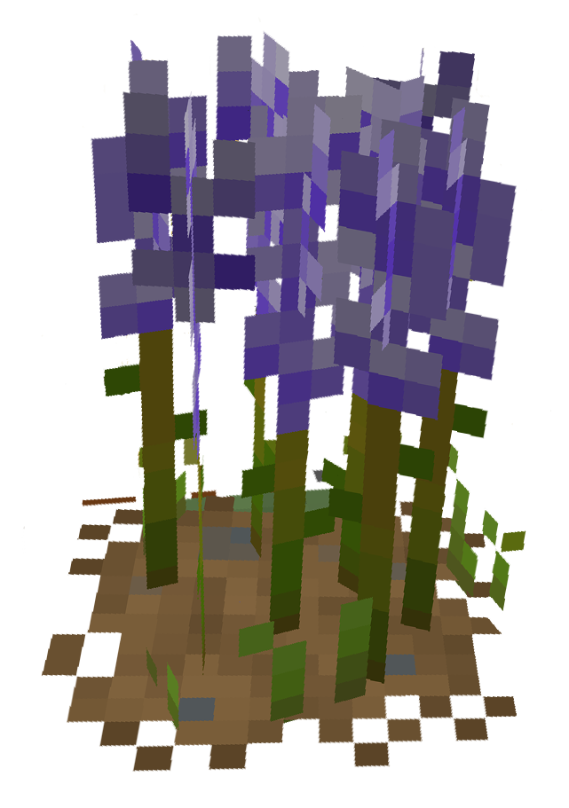
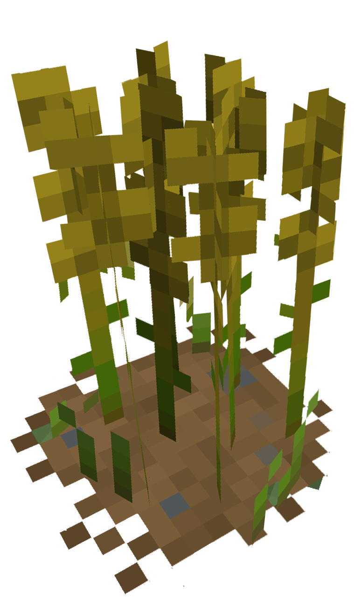

# Herboriste


Il existe dans le Palier 1 deux types de Plantes à récolter :

* 🪻 <mark style="color:purple;">Alliums</mark>
* 🌾 <mark style="color:yellow;">Blé</mark>


<h2 align="center">Alliums</h2>


Les Alliums sont récupérables au niveau 1 d'Herboriste




<figure><figcaption></figcaption></figure>



Les Alliums sont des plantes violettes récupérable dans 3 champs distincts aux alentours de (2324,3677) au Sud du [Quartier OG](../carte/regions/quartier-og.md). Environ 10 plants d'Alliums sont présents par champ.



***

<h2 align="center">Blé</h2>


Le Blé est récupérables au niveau 1 d'Herboriste




<figure><figcaption></figcaption></figure>



Les Épis de Blé sont récupérables dans le champ (2365,3653) au Sud du [Quartier OG](../carte/regions/quartier-og.md). Environ 20 plants de Blé sont présents par champ.


