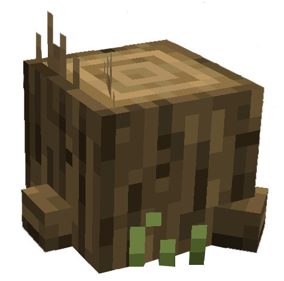
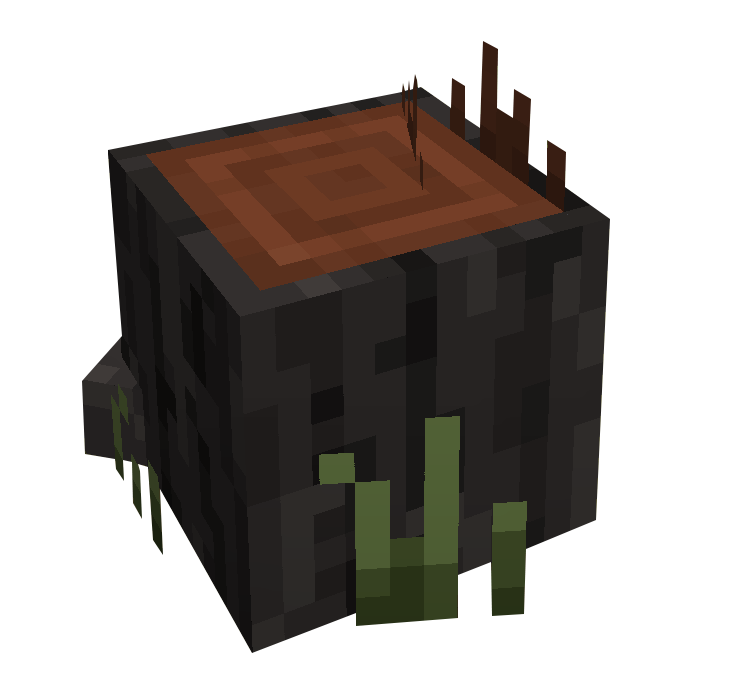

# Bucheron


Il existe dans le Palier 2 deux types de Bois à récolter :

* 🌳 <mark style="color:green;">Chêne</mark>
* 🌴 <mark style="color:orange;">Acacia</mark>


Les Bûches se divisent en deux catégories :\
_Exemple avec le Chêne_




<figure><figcaption></figcaption></figure>




Souche de Bois\
Donne 1 Bûche à la récolte






<figure><figcaption></figcaption></figure>




Bûche de Bois\
Donne 2 Bûches à la récolte



<h2 align="center">Chêne</h2>


Les Bûches de Chêne sont récupérables au niveau 1 de Bucheron




<figure><figcaption></figcaption></figure>



Les Bûches de Chêne sont récupérables sous certains arbres du [Désert des Crocs Argentés](../carte/regions/desert-des-crocs-argentes.md) (-305,-516).



***

<h2 align="center">Acacia</h2>


Les Bûches d'Acacia sont récupérables au niveau 2 de Bucheron




<figure><figcaption></figcaption></figure>



Les Bûches d'Acacia sont récupérables en dessous du [Baobab Millénaire](../carte/regions/baobab-millenaire.md) (-90,-124). De plus vous pouvez en récupérer en dessous de certains arbres dans tout le Palier 2


