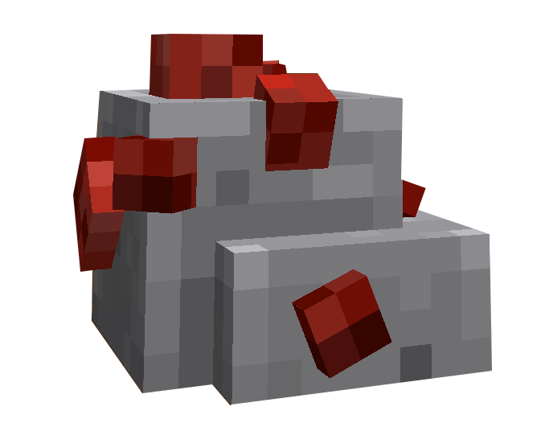
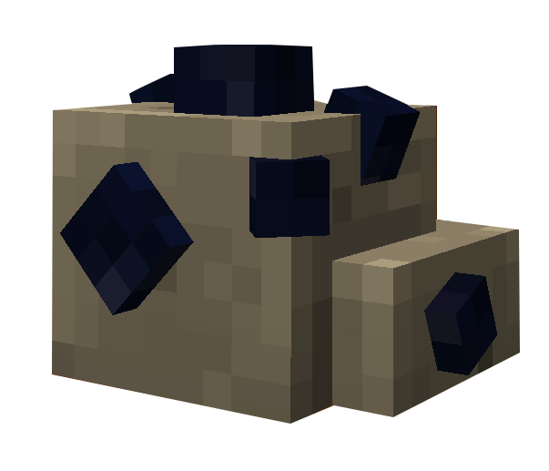

# Mineur


Il existe dans le Palier 2 deux types de minerais à récolter :

* 🧱 <mark style="color:$danger;">Bauxite</mark>
* 🪨  Onyx


<h2 align="center">Bauxite</h2>


Le Bauxite est récupérable au niveau 2 de Mineur




<figure><figcaption></figcaption></figure>



Les Minerais de Charbon sont récupérables dans la [Grotte de Taran](../carte/regions/grotte-de-taran.md) (-296,-59) en surnombre



***

<h2 align="center">Onyx</h2>


L'Onyx est récupérable au niveau 2 de Mineur




<figure><figcaption></figcaption></figure>



Les Minerais d'Onyx sont récupérables dans la [Grotte de Taran](../carte/regions/grotte-de-taran.md) (-296,-59) en très faible quantité. Il y a 3 minerais côte à côte en (-383,-26)




Les Minerais d'Onyx se divisent en deux minerais distincts :

* Minerais d'Onyx Impure
* Minerais d'Onyx Pure

Vous avez 1 chance sur 3 d'obtenir un minerai d'Onyx Pure

